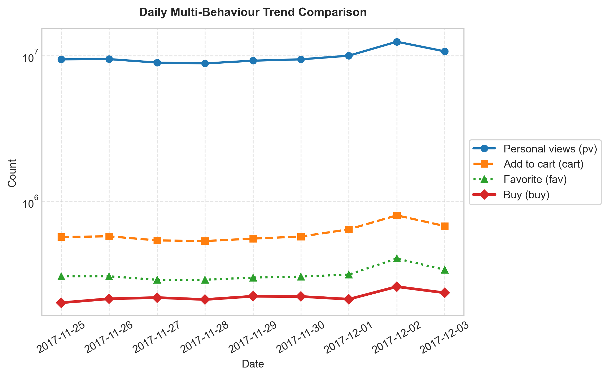
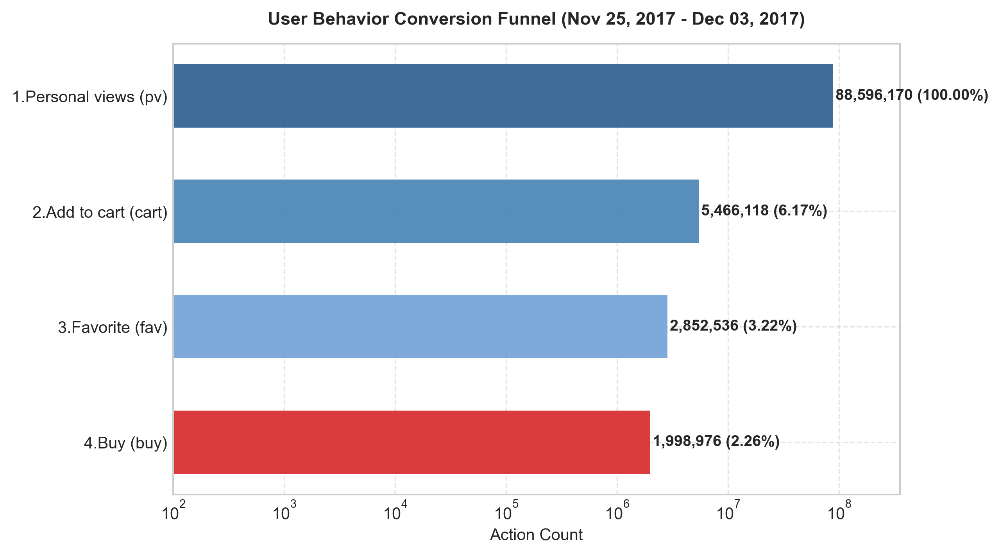
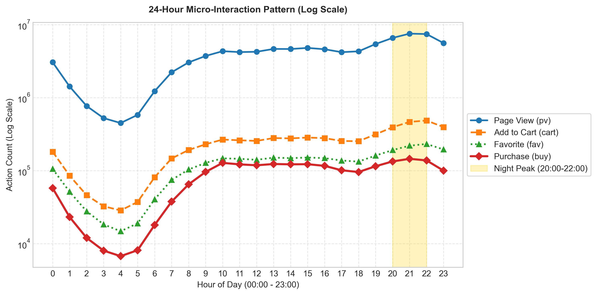
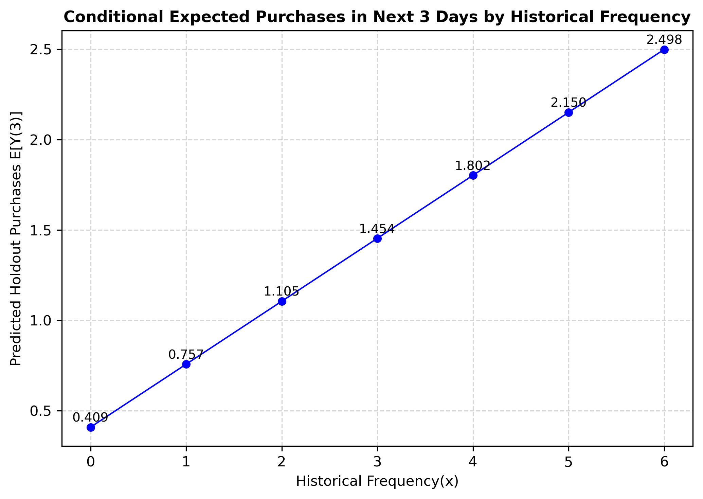
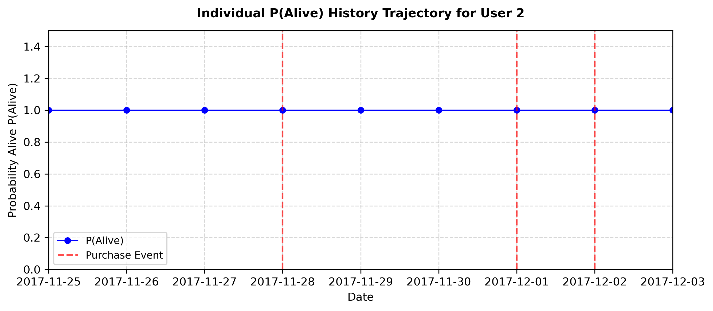
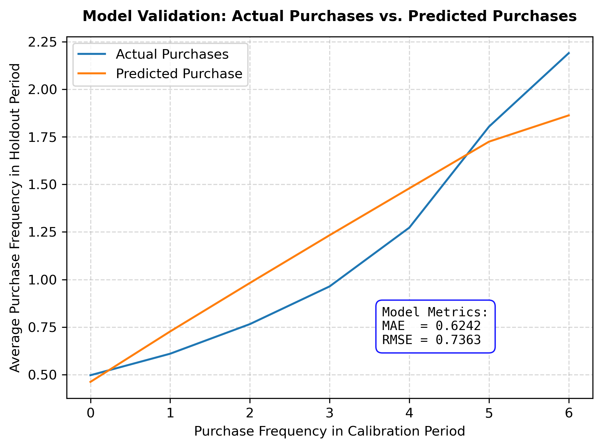
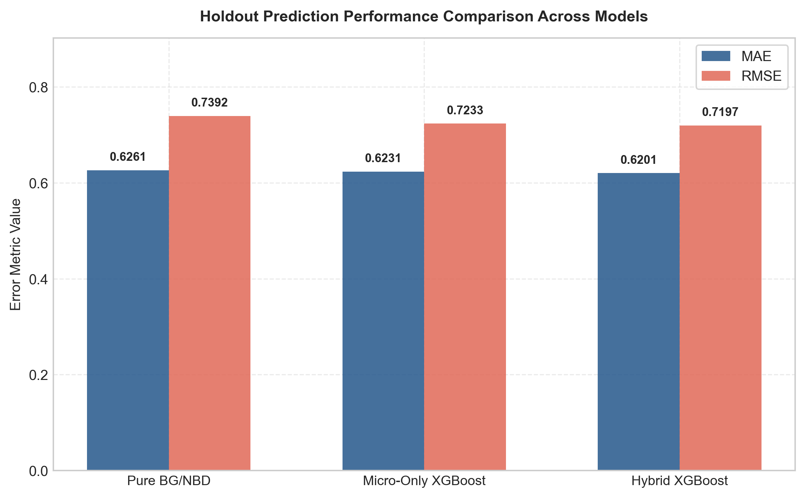
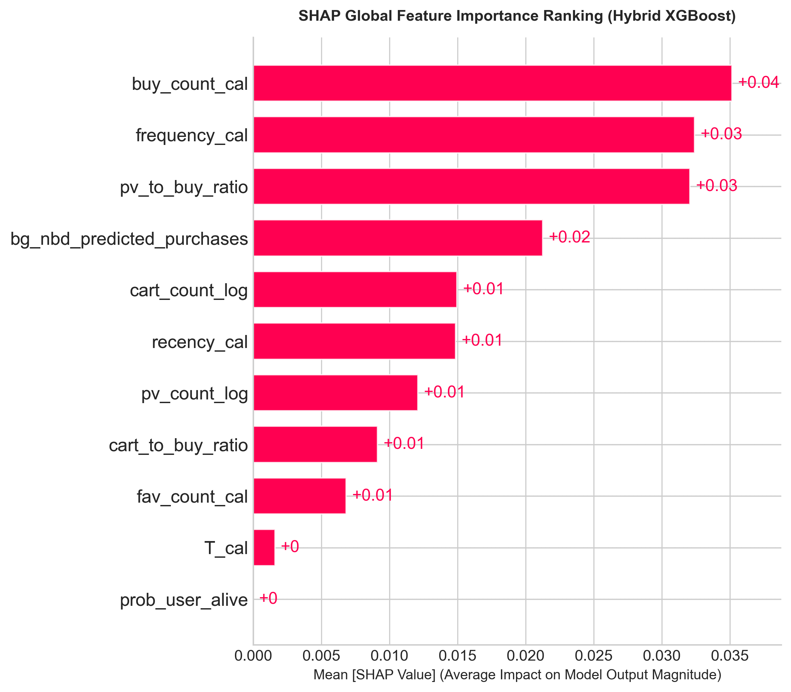
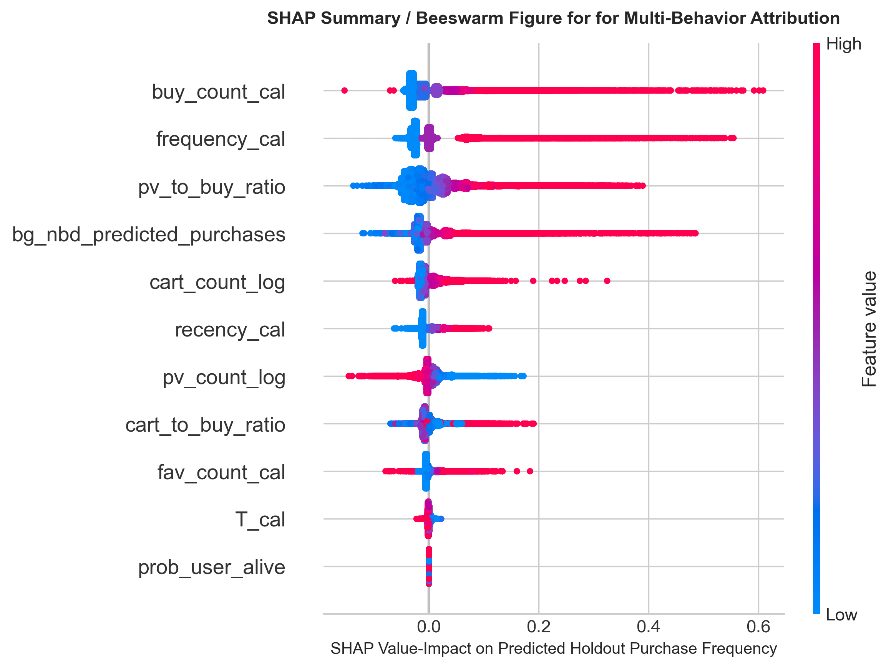

# 🛒 E-Commerce Customer Lifetime Value (CLV) Predictive Analytics
> **A Two-Stage Hybrid Framework Combining BG/NBD Probabilistic Model and Gradient Boosted Trees (XGBoost) with SHAP Interpretability**

[](https://www.python.org/)
[](https://xgboost.readthedocs.io/)
[](https://github.com/slundberg/shap)
[](https://opensource.org/licenses/MIT)

---

## 📌 Executive Summary

Predicting short-term customer repurchase frequency and Customer Lifetime Value (CLV) during promotional campaigns is challenging due to extreme **zero-inflation** and **long-tail right-skewness** in transaction data. 

This repository implements an end-to-end data science architecture on the **Alibaba Taobao User Behavior Dataset (~100 Million interaction logs, 3.67 GB)**:
1. **Stage 1 (Macro Priors)**: Utilizes the **BG/NBD (Beta-Geometric/Negative Binomial Distribution)** stochastic model to capture latent churn probabilities $P(\text{Alive})$ and baseline transaction rates.
2. **Stage 2 (Micro Signal Integration)**: Feeds empirical Bayesian priors alongside non-linear log-transformed micro-clickstream signals (`pv`, `cart`, `fav`, and interaction-to-purchase ratios) into an **XGBoost Regressor** with $L_1/L_2$ regularization.
3. **Statistical Validation & Interpretability**: Validates performance via **Paired t-tests**, **Wilcoxon signed-rank tests**, **5-Fold Cross-Validation**, and **TreeSHAP** game-theoretic feature attribution.

---

## 🏗️ Project Architecture & Pipeline

```text
TaoBao-CLV-Predictive-Analytics/
├── data/
│   ├── sample_data.csv                   # First 1,000 records for fast pipeline testing
│   └── .gitkeep                          # (Raw 3.67GB UserBehavior.csv git-ignored)
├── figures/                              # High-resolution generated visual plots
│   ├── EDA/                              # Daily trends, conversion funnel, 24h patterns
│   ├── NBD/                              # Recency-frequency matrices, P(Alive) decay, MAE/RMSE
│   └── XGBoost/                          # Model benchmark, SHAP bar, SHAP beeswarm
├── notebooks/                            # Annotated end-to-end research pipelines
│   ├── 01_eda_data_exploration.ipynb     # Chunk-ingestion, outlier cleaning, behavioral EDA
│   ├── 02_bgnbd_probabilistic_model.ipynb # Calibration/Holdout split & BG/NBD MLE estimation
│   └── 03_xgboost_hybrid_modeling_shap.ipynb # Two-stage XGBoost, hypothesis testing, SHAP
├── output/                               # Processed intermediate feature matrices
│   ├── .gitkeep                          # Directory placeholder ensuring pipeline execution
│   ├── total_behaviour_summary.csv       # Daily macro interaction summary
│   ├── user_micro_behavior_features.csv  # (Auto-generated by Notebook 01, git-ignored)
│   └── bgnbd_features_for_xgboost.csv    # (Auto-generated by Notebook 02, git-ignored)
├── requirements.txt                      # Environment dependencies
├── .gitignore
└── README.md
```

---

## 📊 Phase 1: Exploratory Data Analysis (EDA)

To prevent Out-Of-Memory (OOM) failures from the 3.67 GB raw log file, a chunk-streaming pipeline (`chunksize=1,000,000`) filters timestamp overflows and segments the 9-day promotional timeline (2017-11-25 to 2017-12-03) into **Calibration (6 days)** and **Holdout (3 days)** periods.

| Daily Interaction Trend | Conversion Funnel | 24-Hour Behavioral Rhythm |
| :---: | :---: | :---: |
|  |  |  |

- **Traffic Dynamics**: Page views (`pv`) dominate macro-volume, peaking significantly on weekends and promotional days.
- **Conversion Efficiency**: `pv` $\rightarrow$ `cart` drops sharply, while `cart` $\rightarrow$ `buy` shows high conversion intent.
- **Diurnal Rhythm**: User activity shows a prominent night peak between **20:00 and 22:00**.

---

## 📈 Phase 2: Econometric Benchmark (BG/NBD Model)

Using the calibration window (Nov 25 – Nov 30, 2017), we aggregate historical transaction logs into an **RF-T Matrix** ($x$: frequency, $t_x$: recency, $T$: customer age) and estimate prior parameters via Penalized Maximum Likelihood Estimation (MLE with $L_2$ penalty $= 0.01$).

$$\hat{\Theta} = \{ r = 1.1744,\; \alpha = 5.5541,\; a = 1.7456 \times 10^{-15},\; b = 7.3919 \times 10^{-6} \}$$

| Expected Holdout Purchases $E[Y(3)]$ | Individual $P(\text{Alive})$ Trajectory | Actual vs. Predicted Purchases |
| :---: | :---: | :---: |
|  |  |  |

> **Diagnostic Insight**: In short promotional windows (6 days), dropout parameters $a, b \approx 0$ lead to $P(\text{Alive}) \approx 1.0$, degenerating the Pareto dropout mechanism into a pure Poisson repeat-purchase model. This empirical limitation necessitates incorporating granular clickstream behavioral signals.

---

## 🤖 Phase 3: Machine Learning Modeling & Benchmarking

We construct a two-stage hybrid regressor by merging BG/NBD Bayesian priors ($P(\text{Alive})$, $E[Y(t)]$, $T$) with log-smoothed micro-behavior features (`pv_count_log`, `cart_count_log`, `cart_to_buy_ratio`, `pv_to_buy_ratio`).

### Hyperparameter Configuration (XGBoost Regressor)
```python
xgb_parameters = {
    'objective': 'reg:squarederror',
    'n_estimators': 150,
    'learning_rate': 0.05,
    'max_depth': 4,
    'subsample': 0.8,
    'colsample_bytree': 0.8,
    'reg_alpha': 0.1,
    'reg_lambda': 1.0,
    'random_state': 14,
    'n_jobs': -1
}
```

### Model Performance Comparison (Ablation Study on Test Set, $N_{\text{test}} = 106,056$)

| Model Architecture | Feature Space | MAE | RMSE | MAE Imprv. (%) | RMSE Imprv. (%) |
| :--- | :--- | :---: | :---: | :---: | :---: |
| **Model 1: Pure BG/NBD** | Macro RF-T ($x, t_x, T$) | 0.6261 | 0.7392 | Baseline | Baseline |
| **Model 2: Micro-Behavior Only** | Clickstream (`pv`, `cart`, `fav`, ratios) | 0.6231 | 0.7233 | +0.48% | +2.15% |
| **Model 3: Two-Stage Hybrid** | **Bayesian Priors + Micro Clickstream** | **0.6201** | **0.7197** | **+0.96%** | **+2.64%** |

<p align="center">
  
</p>

### Statistical Significance & Robustness
- **Paired $t$-Test**: $t = 11.9723,\; p = 2.61 \times 10^{-33}$ (Rejects $H_0$ with extreme significance)[cite: 7]
- **Wilcoxon Signed-Rank Test**: $W = 2.88 \times 10^9,\; p = 2.57 \times 10^{-12}$ (Confirms error reduction is robust against non-normal skewness)[cite: 7]
- **5-Fold Cross Validation**:
  - Baseline BG/NBD MAE: $0.6242 \pm 0.0013$[cite: 7]
  - Hybrid XGBoost MAE: $0.6177 \pm 0.0015$ (**Consistent 1.05% gain across all folds**)[cite: 7]

---

## 🔍 Phase 4: Model Interpretability & Feature Attribution (SHAP)

Using TreeSHAP, we explain the marginal contribution and driving direction of each feature on predicted holdout purchase frequency:

| Global Feature Importance (Mean $\|SHAP\|$) | SHAP Summary Beeswarm Distribution |
| :---: | :---: |
|  |  |

- **Top Predictor**: `bg_nbd_predicted_purchases` acts as the strongest macro anchor.
- **Micro Behavioral Drivers**: `cart_count_log` and `pv_to_buy_ratio` provide the largest non-linear uplift. High cart volume strongly pushes the model prediction towards repeat conversion.

---

## 🎯 Phase 5: Customer Value Tiering & Business Strategy

Based on the predicted purchase frequency $\hat{y}_i = E[Y_i(3)]$, customers are segmented into 4 actionable CLV tiers:

| CLV Tier | Segmentation Threshold | User Count | User Share (%) | Value Contribution (%) | Core Action Strategy |
| :--- | :---: | :---: | :---: | :---: | :--- |
| **1. High-Value Champions** | $\hat{y}_i \ge 1.5$ | 440 | 0.41% | 1.31% | Exclusive VIP loyalty rewards, cross-category upsell |
| **2. Growth Potential** | $0.8 \le \hat{y}_i < 1.5$ | 7,872 | 7.42% | 12.33% | Cart abandonment push notifications, tailored discount bundles |
| **3. Low-Value Marginal** | $0.3 \le \hat{y}_i < 0.8$ | 97,743 | 92.16% | 86.37% | High-margin automated recommendations, mass coupons |
| **4. Inactive / Churn Risk** | $\hat{y}_i < 0.3$ | 1 | 0.00% | 0.00% | Re-activation recall campaigns |

---

## 🚀 Quick Start & Reproduction

### 1. Clone the repository
```bash
git clone [https://github.com/SelcouthCat/TaoBao-CLV-Predictive-Analytics.git](https://github.com/SelcouthCat/TaoBao-CLV-Predictive-Analytics.git)
cd TaoBao-CLV-Predictive-Analytics
```

### 2. Install dependencies
```bash
pip install -r requirements.txt
```

### 3. Data Setup
1. Download the raw dataset from [Alibaba Tianchi User Behavior Dataset](https://tianchi.aliyun.com/dataset/649) or [Kaggle](https://www.kaggle.com/datasets/gogokerry/taobao-user-behavior).
2. Place `UserBehavior.csv` inside the `data/` directory (or use `data/sample_data.csv` for unit testing).

### 4. Execute Notebooks sequentially
Run the Jupyter notebooks in order:
```bash
jupyter notebook notebooks/01_eda_data_exploration.ipynb
jupyter notebook notebooks/02_bgnbd_probabilistic_model.ipynb
jupyter notebook notebooks/03_xgboost_hybrid_modeling_shap.ipynb
```
